# Lab 01
## Bài 1: Thiết lập môi trường
### 1.1 Đăng ký tài khoản MongoDB Atlas và tạo cluster miễn phí trên dịch vụ đám mây
**Đăng ký tài khoản**

Ta có thể chọn đăng ký tài khoản hoặc login bằng các phương thức khác như Gmail hoặc Github, ở đây để cho thuận tiện ta sử dụng Gmail để login.

**Tạo Cluster**

Giao diện tạo Cluster:
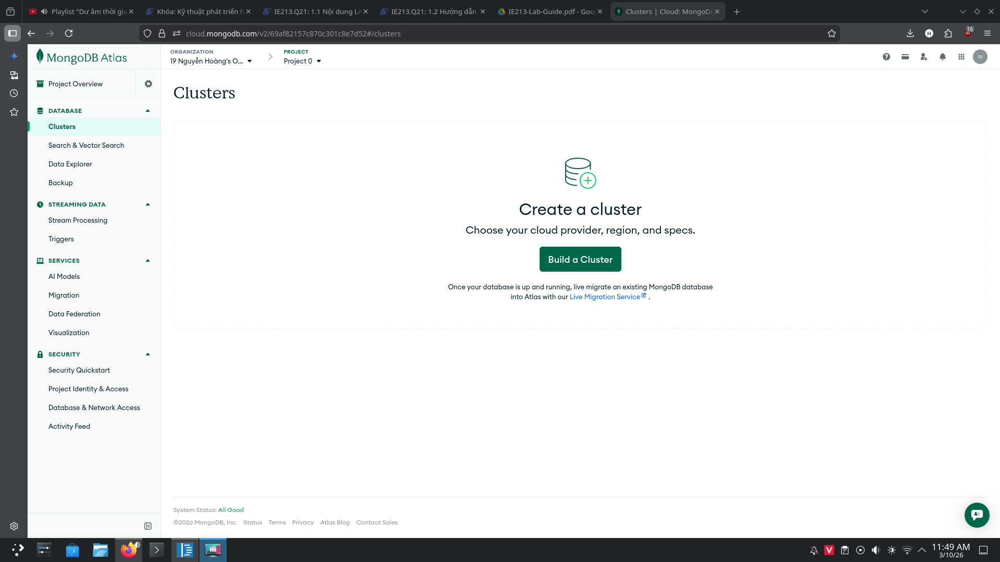
Custome Cluster:
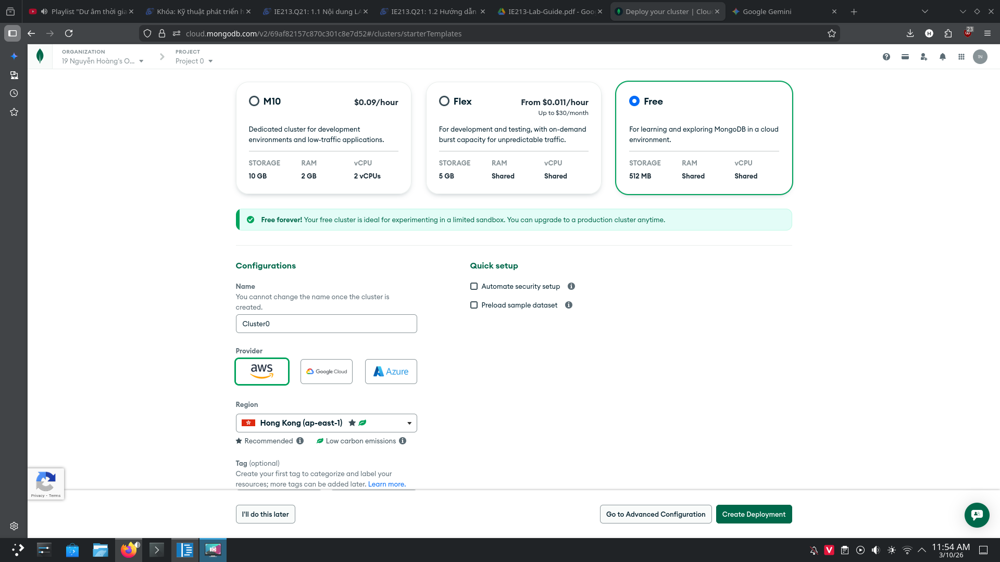
**Lưu ý:** Các lựa chọn "Automate security setup" và "Preload sample dataset" mặc định được chọn, ta bỏ chọn các mục này để có thể tách ra làm các câu hỏi riêng tiếp theo.


Chọn "Create Deployment" để tạo Cluster 

### 1.2 Tìm nạp dữ liệu mẫu trên MongoDB Atlas vào Cluster
Sau khi tạo Cluster ta sẽ thấy giao diện sau, bấm vào button "Load Sample Data"để mở cửa sổ chọn sample datasets
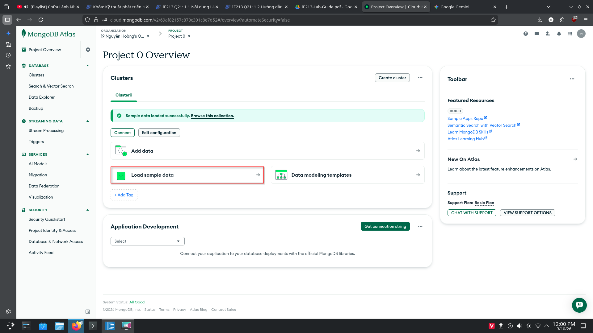
Sau đó click vào button "Load sample data"
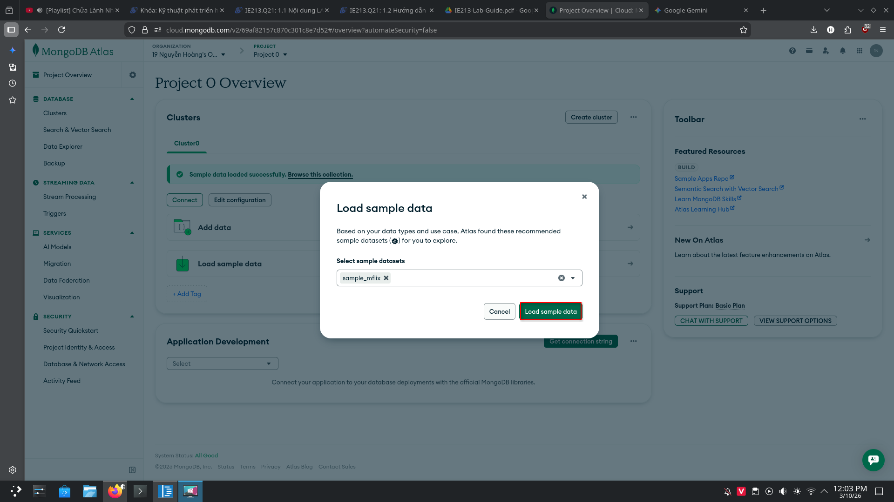
Kết nối với Cluster để kiểm tra thì thấy Sample datasets vừa chọn đã được thêm vào Cluster
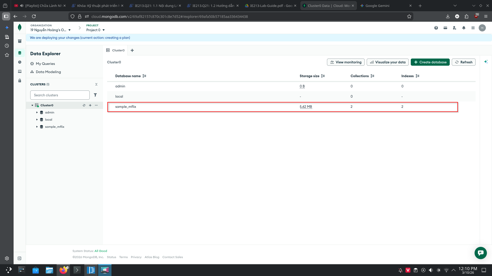

### 1.3 Cài đặt MongoDB Compass trên máy tính 
Máy tính được sử dụng để làm bài thực hành này đang sử dụng Arch Linux nên cài đặt bằng lệnh sau:
```
yay -S mongodb-compass-bin
```
### 1.4 Kết nối MongoDB Compass với cluster đã tạo trên MongoDB

Để connect với Cluster ta phải thực hiện các yêu cầu sau:

- Tạo database user
- Add Entry vào IP Acess List

Quay lại với MongoDB Atlas, ta tìm đến mục "Security Quickstart" để setup cả 2 yêu cầu trên

**Tạo database user**
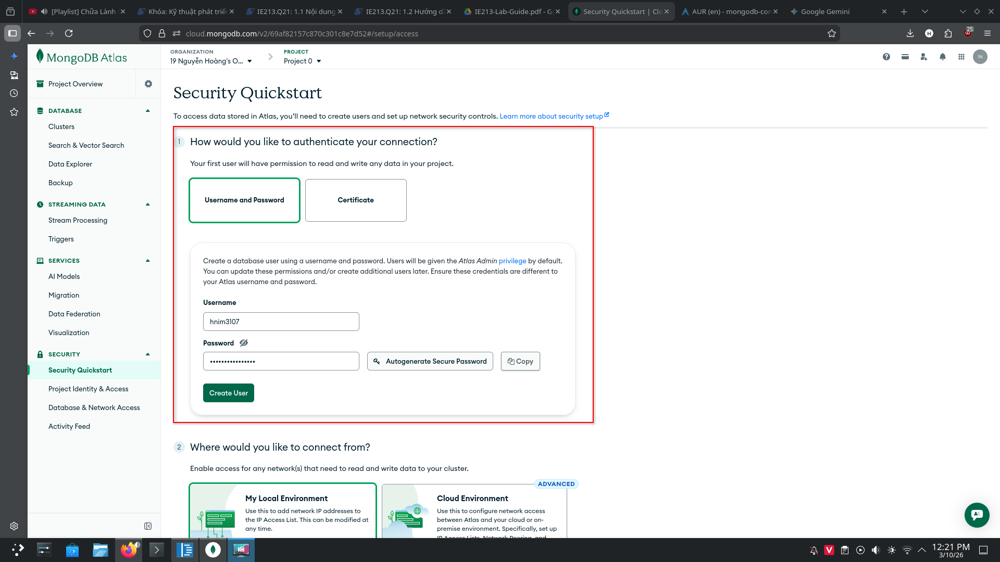
Nhập vào username và password, ở mục password để tăng tính bảo mật ta có thể chọn "Autogenerate Secure Password", ta Copy password này lại để lát sử dụng. Sau đó chọn "Create User"

**Add Entry vào IP Acess List**
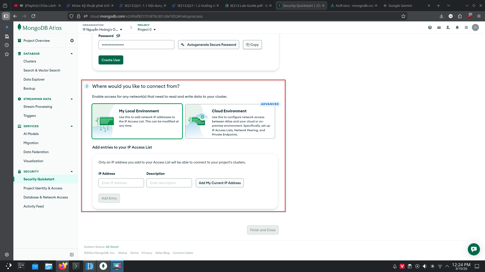
Ta có thể nhập vào địa chỉ IP ta muốn hoặc chọn "Add My Current IP Address" để thêm địa chỉ IP hiện tại của máy tính vào. Sau đó chọn "Add Entry"

**Lưu ý:** Với một số khu vực "đặc biệt" đơn cử là hệ thống mạng của trường UIT, ta không thể kết nối nếu chỉ add 1 địa chỉ IP mà phải add bằng địa chỉ "0.0.0.0/0" tức là chấp nhận mọi địa chỉ IP

Quay về mục Cluster ta bấm vào button "Connect":
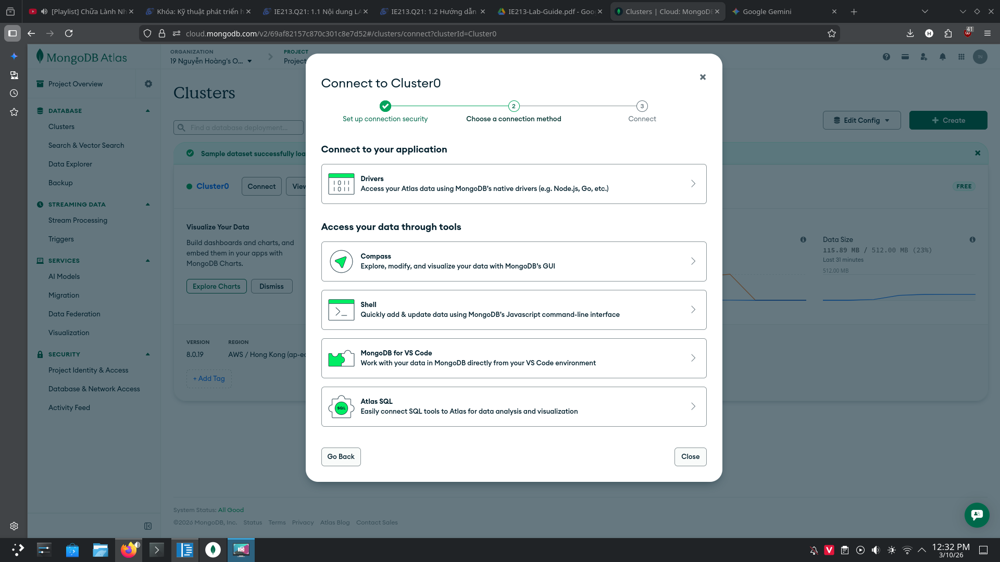
Một giao diện hiện lên và ta có thể chọn mục Drivers hoặc Compass đều có thể connect với MongoDB Compass trên máy được, ta chọn mục Compass.
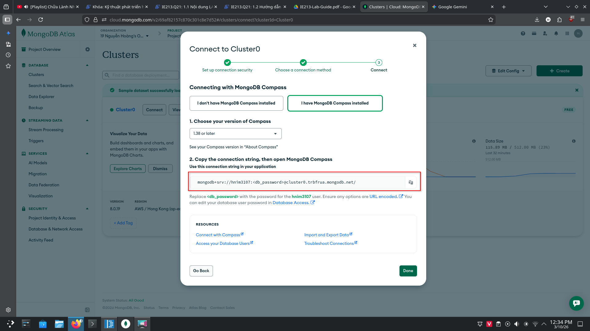
Copy chuỗi connection string và thay <db_password> bằng password mà ta đã copy ở trên"

Tại giao diện của MongoDB Compass ta chọn "Add new connection" và dán chuỗi trên vào mục URI
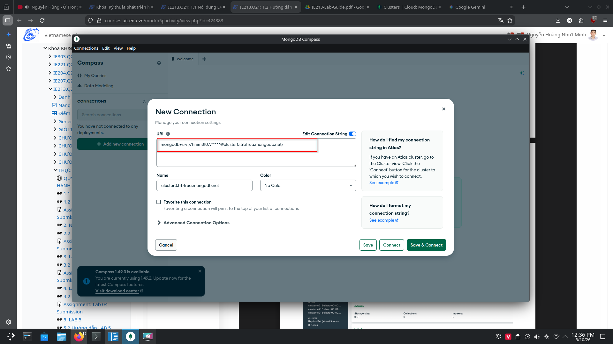
Chọn "Save & Connect"
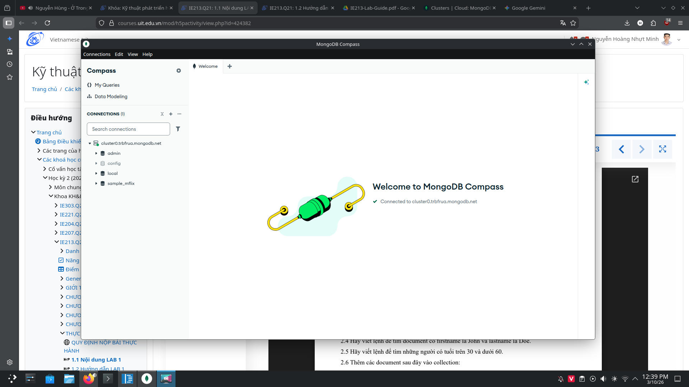
Giao diện khi đã connect thành công

## Bài 2: Sử dụng MONGOSH
### 2.1 Tạo CSDL có tên 23520939-IE213 trên Cluster
Để mở MONGOSH ta nháy cuột phải vào cluster > Open MongoDB Shell
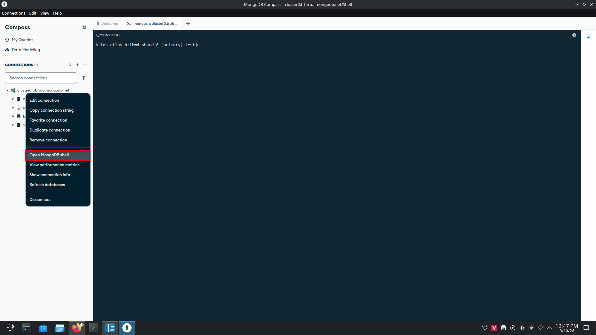
Để tạo CSDL mới có tên 23520939-IE213 ta sử dụng lệnh sau:
```
use 23520939-IE213
```
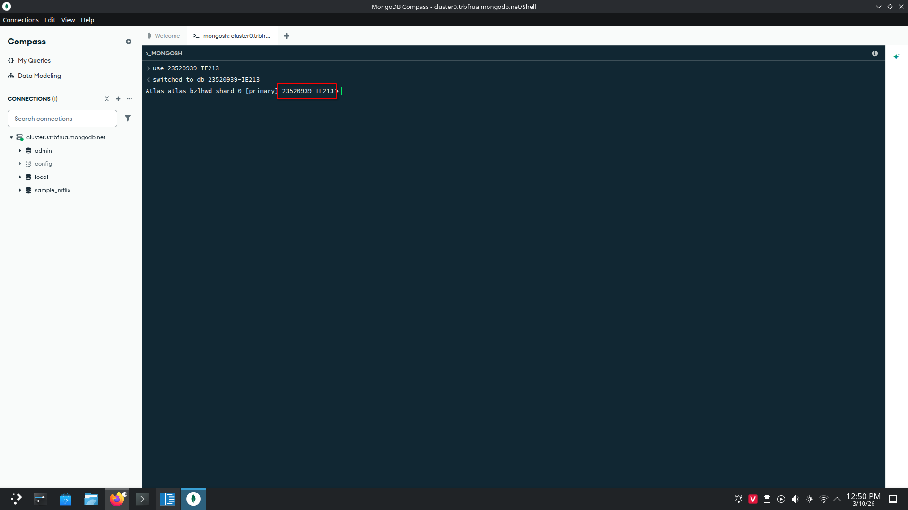
Vùng màu đỏ chứng tỏ ta đang sử dụng CSDL có tên là 23520939-IE213
### 2.2 Thêm các document sau đây vào collection có tên là employees trong db vừa được tạo
```
{"id":1,"name":{"first":"John","last":"Doe"},"age":48}
{"id":2,"name":{"first":"Jane","last":"Doe"},"age":16}
{"id":3,"name":{"first":"Alice","last":"A"},"age":32}
{"id":4,"name":{"first":"Bob","last":"B"},"age":64}
```
Để thực hiện yêu cầu trên ta sử dụng insertMany() để add nhiều document cùng lúc cụ thể như sau:
```
db.employees.insertMany([
    {"id":1,"name":{"first":"John","last":"Doe"},"age":48},
    {"id":2,"name":{"first":"Jane","last":"Doe"},"age":16},
	{"id":3,"name":{"first":"Alice","last":"A"},"age":32},
	{"id":4,"name":{"first":"Bob","last":"B"},"age":64},
])
```
Kết quả thu được:
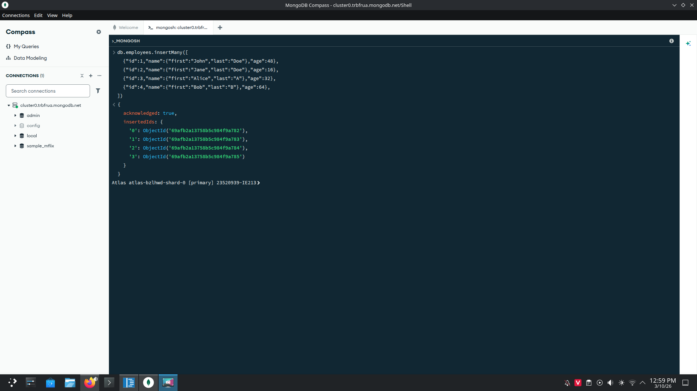

### 2.3 Biến trường id trong các document trên trở thành duy nhất. Có nghĩa là không thể thêm một document mới với giá trị id đã tồn tại.
Để thực hiện yêu cầu trên ta sử dụng lệnh createIndex() cụ thể như sau:
```
db.employees.createIndex({ id: 1 }, { unique: true })
```
**Giải thích:**
- db.employees: Chỉ định thao tác trên collection employees.

- createIndex({ id: 1 }): Tạo một chỉ mục (index) cho trường id theo thứ tự tăng dần (1). Việc tạo index giúp việc tìm kiếm theo id cực nhanh.

- { unique: true }: Đây là tham số quan trọng nhất. Nó ra lệnh cho MongoDB rằng: "Kể từ bây giờ, không một document nào trong collection này được phép có giá trị id giống nhau".

Kết quả thu được và kiểm tra:
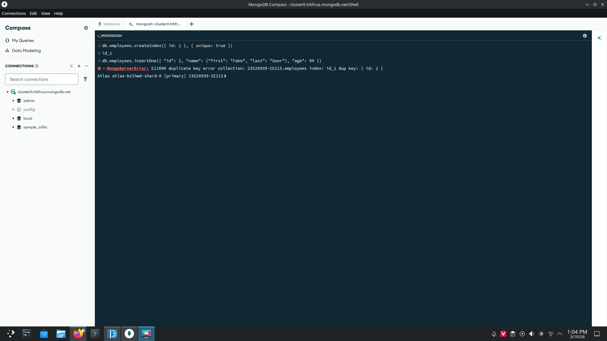

### 2.4 Viết lệnh để tìm document có firstname là John và lastname là Doe.

Để thực hiện yêu cầu trên ta thực hiện lệnh find() với các bộ lọc name.first và name.last cụ thể như sau:
```
db.employees.find({"name.first":"John", "name.last":"Doe"})
```
Kết quả thu được: 
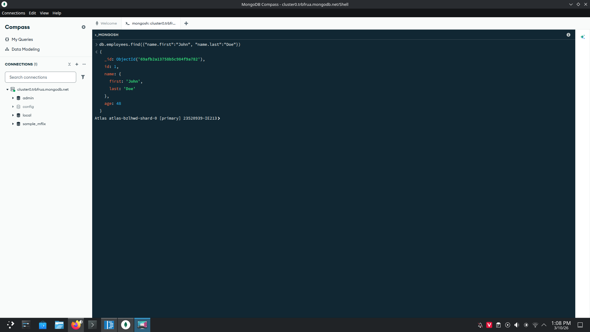

### 2.5 Viết lệnh để tìm những người có tuổi trên 30 và dưới 60.
Để thực hiện yêu cầu trên ta sử dụng lệnh find() và toán tử $and cùng với bộ lọc age cụ thể như sau:
```
db.employees.find({
  $and: [
  	{ age: { $gt: 30 } },
    { age: { $lt: 60 } }
  ]
})
```
Kết quả thu được: 
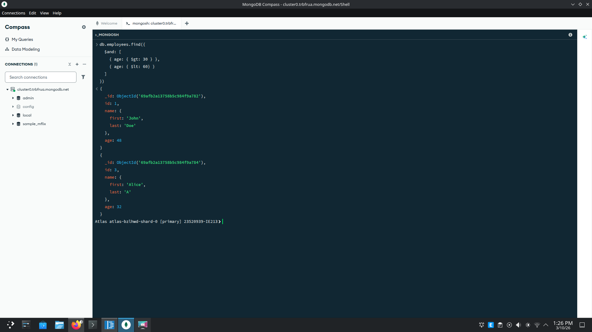

### 2.6 Thêm các document sau đây vào collection:
```
{"id":5,"name":{"first":"Rooney", "middle":"K", "last":"A"},"age":30}
{"id":6,"name":{"first":"Ronaldo", "middle":"T", "last":"B"},"age":60}
```
### Sau đó viết lệnh để tìm tất cả các document có middle name.

Để thêm các document trên ta sử dụng lệnh:
```
db.employees.insertMany([
    {"id":5,"name":{"first":"Rooney", "middle":"K", "last":"A"},"age":30},
    {"id":6,"name":{"first":"Ronaldo", "middle":"T", "last":"B"},"age":60}
])
```
Kết quả thu được:


Để tìm các document có middle name ta sử dụng lệnh find() với toán tử $exist: true cụ thể như sau:
```
db.employees.find({"name.middle": { $exists:true } })
```
Kết quả thu được: 
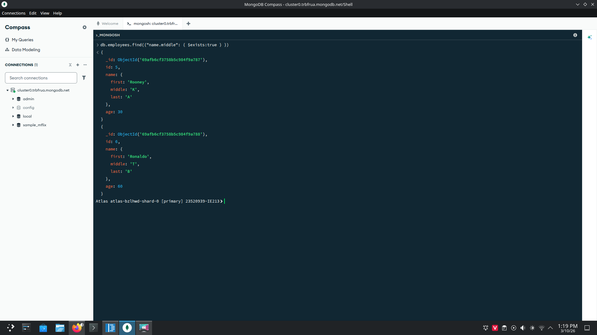

### 2.7 Cho rằng là những document nào đang có middle name là không đúng, hãy xoá middle name ra khỏi các document đó.
Để thực hiện yêu cầu trên ta sử dụng lệnh updateMany() trong đó dùng toán tử $unset: null với các document có middle name cụ thể như sau:
```
db.employees.updateMany(
  { "name.middle": { $exists: true} },
  { $unset: { "name.middle": null} }
)
```
Kết quả thu được và kiểm tra:
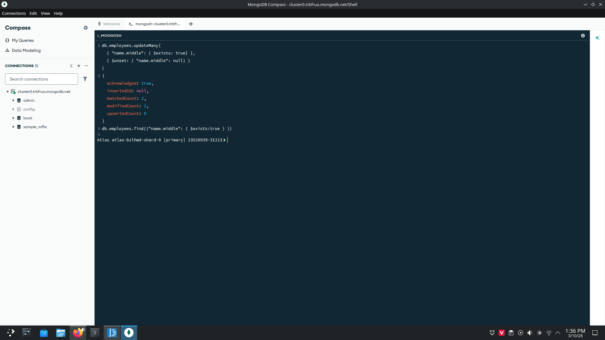

### 2.8 Thêm trường dữ liệu organization: "UIT" vào tất cả các document trong employees collection.
Để thực hiện yêu cầu trên ta dùng updateMany() trong đó dùng toán tử $set với cặp khoá – giá trị là organization: "UIT" cụ thể như sau:
```
db.employees.updateMany(
  {},
  { $set: { "organization": "UIT" } }
)
```
**Giải thích:** Tham số đầu tiên là bộ lọc filter việc ta để "{}" trống tức là ta đang chọn tất cả các document có trong collection.

Kết quả thu được:


### 2.9 Hãy điều chỉnh organization của nhân viên có id là 5 và 6 thành "USSH".
Để thực hiện yêu cầu trên, ta dùng updateMany() trong đó dùng toán tử $set với cặp khoá – giá trị là organization: "USSH" với các document có id 5 và 6 cụ thể như sau:
```
db.employees.updateMany(
  { id: { $in: [5, 6] } },
  { $set: { organization: "USSH" } }
)
```
**Giải thích:** Thay vì phải chạy lệnh updateOne hai lần, toán tử $in giúp ta chọn tất cả các document có id nằm trong mảng [5, 6].

Kết quả thu được: 
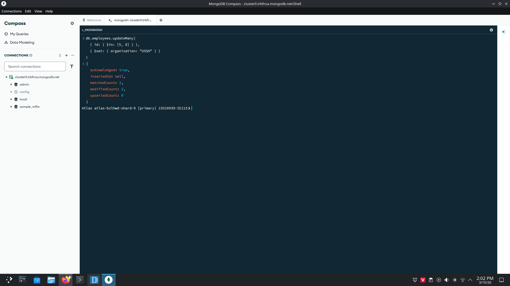

### 2.10 Viết lệnh để tính tổng tuổi và tuổi trung bình của nhân viên thuộc 2 organization là UIT và USSH.
Để thực hiện yêu cầu trên ta dùng aggregate() trong đó dùng toán tử $group với _id: "$organization" cụ thể như sau:
```
db.employees.aggregate([
  {
    $group: {
      _id: "$organization",
      totalAge: { $sum: "$age" },
      avgAge: { $avg: "$age" }	
    }
  }
])
```
**Giải thích:** 
- ```_id: "$organization"```: Gom nhóm dựa trên giá trị của trường organization. Kết quả khi thực hiện ở đây sẽ gồm 2 nhóm "UIT" và nhóm "USSH"
- ```totalAge: { $sum: "$age"}```: Tạo trường mới có tên là totalAge bằng cách cộng dồn tất cả các giá trị của trường age trong nhóm đó
- ```avgAge: { $avg: "$age"}```: Tạo trường mới có tên là avgAge bằng cách tính trung bình cộng của trường age trong nhóm đó.

Kết quả thu được:
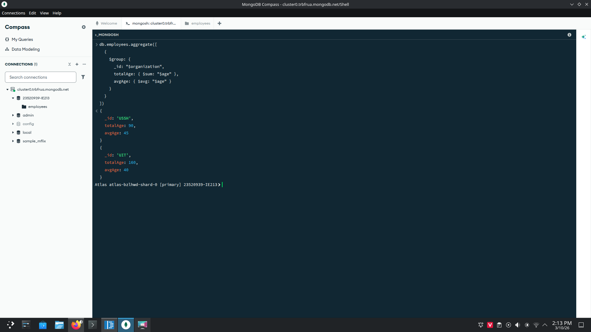