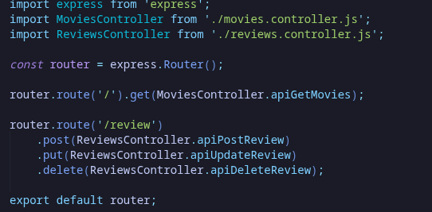
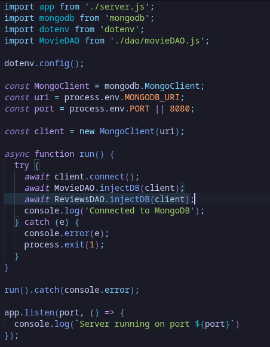
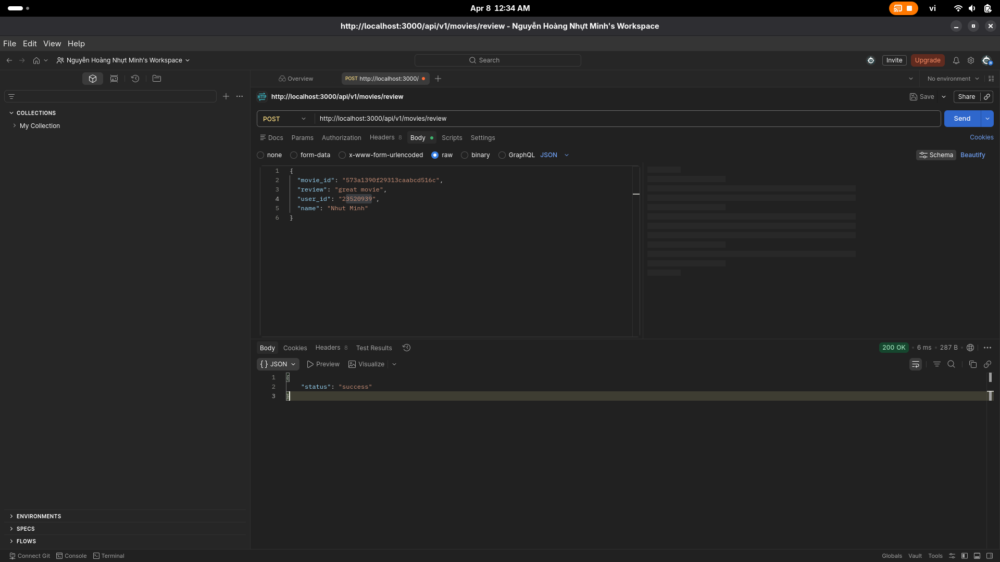
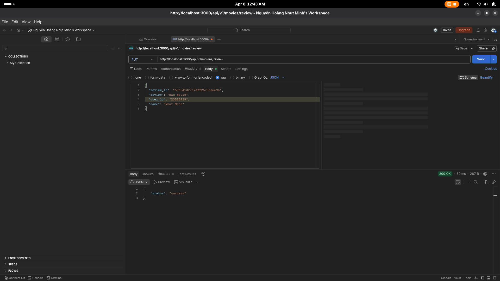
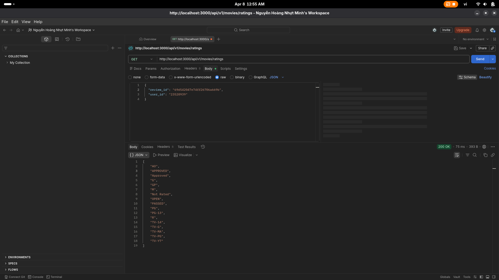
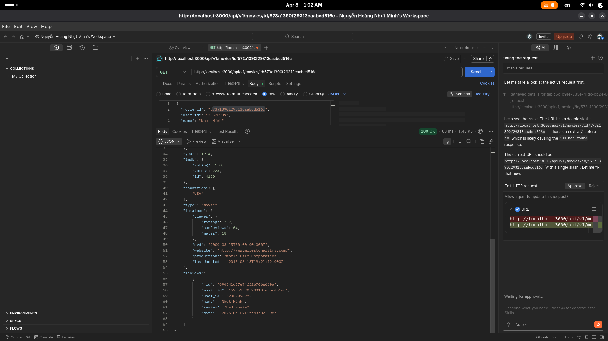

# Lab 03
## Bài 1: Thiết lập định tuyến cho các thao tác với review trong ứng dụng minh họa 
Việc này cần thực hiện trong tệp tin movies.router.js
### 1.1 Định tuyến này sẽ có đường dẫn cuối cùng là '/review'
### 1.2 Thiết lập định tuyến thêm review vào db thông qua phương thức post, và gọi đến phương thức apiPostReview trong class ReviewsController trong tệp tin reviews.controller.js mà ta sẽ thiết lập ở bài 2.
### 1.3 Thiết lập định tuyến sửa review trên db thông qua phương thức put, và gọi đến phương thức apiUpdateReview trong class ReviewsController trong tệp tin reviews.controller.js mà ta sẽ thiết lập ở bài 2.
### 1.4 Thiết lập định tuyến xóa review trên db thông qua phương thức delete, và gọi đến phương thức apiDeleteReview trong class ReviewsController trong tệp tin reviews.controller.js mà ta sẽ thiết lập ở bài 2.

Để thực hiện 4 yêu cầu trên ta thêm đoạn code sau vào file movies.routes.js 
```JavaScript
router.route('/review')
    .post(ReviewsController.apiPostReview)
    .put(ReviewsController.apiUpdateReview)
    .delete(ReviewsController.apiDeleteReview);
```
Lưu ý: Đừng quên import ReviewsController vào file movies.routes.js

File movies.routes.js sau khi hoàn tất tạo các định tuyến theo yêu cầu


## Bài 2: Thiết lập Controller cho review.
### 2.1 Tạo tệp tin reviews.controller.js trong thư mục api chứa một class có tên ReviewsController để quản lý các yêu cầu có liên quan đến review từ người dùng gửi lên từ máy khách
### 2.2 Trong tệp tin vừa tạo ở bài 2.1 sẽ chứa dòng lệnh import nội dung từ tệp tin reviewsDAO.js (sẽ tạo ở bài 3) để gọi tới các hàm tương tác dữ liệu.
### 2.3 Tạo phương thức có tên apiPostReview() để quản lý các yêu cầu được gửi từ máy khách (thiết lập ở bài 1.2).
- Phương thức này sẽ lấy dữ liệu gửi lên từ người dùng thông qua tham số req gồm có movie_id, review, userinfo gồm name và id (gửi dưới dạng JSON trong body của req), và tạo ra một biến date để lưu trữ ngày tháng năm hiện tại của review.
- Sau đó, gọi đến hàm addReview() được định nghĩa trong ReviewsDAO (sẽ tạo ở bài 3) để thêm được review vào db.
- Nếu thêm dữ liệu thành công sẽ trả về cho máy khách 1 thông báo dưới dạng JSON báo ‘success’, nếu không thành công sẽ log lỗi ra trên màn hình console của terminal.

Để thực hiện yêu cầu trên ta thực hiện thêm đoạn code sau vào file reviews.controller.js:
```JavaScript
import ReviewsDAO from "../dao/reviewsDAO.js";

export default class ReviewsController {
    static async apiPostReview(req, res, next) {
        try {
            const movieId = req.body.movie_id;
            const review = req.body.review;
            const userInfo = {
                name: req.body.name,
                _id: req.body.user_id
            };
            const date = new Date();

            const reviewResponse = await ReviewsDAO.addReview(); // Add reviews sẽ được implement ở bài 3

            res.json({ status: "success" });
        }
        catch (e) {
            res.status(500).json({ error: e.message });
        }
    }
}
```

### 2.4 Tạo phương thức có tên apiUpdateReview() để quản lý các yêu cầu được gửi từ máy khách (thiết lập ở bài 1.3).
- Phương thức này sẽ lấy dữ liệu gửi lên từ người dùng thông qua tham số req gồm có review_id, user_id (gửi dưới dạng JSON trong body của req), và tạo ra một biến date để lưu trữ ngày tháng năm hiện tại của review mới, lưu ý, muốn update thành công review thì id user phải là user đã tạo ra review.
- Sau đó, gọi đến hàm updateReview() được định nghĩa trong ReviewsDAO (sẽ tạo ở bài 3) để sửa dữ liệu review trên db.
- Nếu thêm dữ liệu thành công sẽ trả về cho máy khách 1 thông báo dưới dạng JSON
báo ‘success’, nếu không thành công sẽ log lỗi ra trên màn hình console của terminal.
- Lưu ý: Cần tạo ra biến ReviewResponse để lấy kết quả trả về khi gọi hàm
updateReview(), vì hàm updateReview() trong bài 3 sẽ có trả về một biến tên là modifiedCount để xác định xem là có review nào thực sự đã được chỉnh sửa hay chưa.

Để thực hiện yêu cầu trên ta thêm đoạn code sau vào file reviews.controller.js:
```JavaScript
    static async apiUpdateReview(req, res, next) {
        try {
            const reviewId = req.body.review_id;
            const userId = req.body.user_id;
            const review = req.body.review;
            const date = new Date();

            const reviewResponse = await ReviewsDAO.updateReview(); // Update reviews sẽ được implement ở bài 3

            var { error } = reviewResponse;
            if (error) {
                res.status(500).json({ error: error });
            }
            if (reviewResponse.modifiedCount === 0) {
                error = "Unable to update review. User may not own this review.";
            }

            res.json({ status: "success", error: error });
        }
        catch (e) {
            res.status(500).json({ error: e.message });
        }
    }
```
### 2.5 Tạo phương thức có tên apiDeleteReview() để quản lý các yêu cầu được gửi từ máy khách (thiết lập ở bài 1.3).
- Phương thức này sẽ lấy dữ liệu gửi lên từ người dùng thông qua tham số req gồm có
review_id, user_ id (gửi dưới dạng JSON trong body của req), và thực hiện việc xoá review
thông qua hàm deleteReview trong lớp ReviewsDAO sẽ tạo ở bài 3.

Để thực hiện yêu cầu trên ta thêm đoạn code sau vào file reviews.controller.js:
```JavaScript
    static async apiDeleteReview(req, res, next) {
        try {
            const reviewId = req.query.review_id;
            const userId = req.query.user_id;

            const reviewResponse = await ReviewsDAO.deleteReview(); // Delete reviews sẽ được implement ở bài 3

            res.json({ status: "success" });
        }
        catch (e) {
            res.status(500).json({ error: e.message });
        }
    }
```

## Bài 3: 
### 3.1 Trong thư mục DAO tạo tệp tin reviewsDAO.js.
- Tệp tin này cần import pakage mongodb đã cài đặt ở lab 2 để sử dụng một số phương
thức cần thiết.
- Tạo một hằng số tên ObjectId = mongodb.ObjectId để sau này xử lý một số tác vụ liên
quan đến trường dữ liệu _id trong mongodb.
- Tạo ra một biến reviews để tham chiếu tới collection reviews sẽ tạo sau trên db.

```JavaScript
import mongodb from "mongodb";

const ObjectId = mongodb.ObjectId;

let reviews;
```
### 3.2 Tạo phương thức có tên injectDB() giúp kết nối tới collection tương ứng trên db.

```JavaScript
    static async injectDB(connect) {
        if (reviews) {
            return;
        }
        try {
            reviews = await connect.db('sample_mflix').collection('reviews');
        }
        catch (e) {
            console.error(`Unable to connect to database: ${e}`);
        }
    }
```

- Cần tạo đối tượng và gọi injectDB() này trong tệp tin index.js để đảm bảo kết nối tới collection reviews trên db.
- Lưu ý: việc gọi injectDB() này trong tệp tin index.js phải sau dòng lệnh kết nối tới dữ liệu và trước khi khởi tạo máy chủ web. 


 
### 3.3 Tạo phương thức addReview() để thêm review vào db, trong hàm này sẽ có gọi một hàm insertOne(), lưu ý phải biến chuỗi movieId trong tham số truyền vào ở bài 2 thành dạng ObjectId.

```JavaScript
    static async addReview(movieId, user, review, date) {
        try {
            const reviewDoc = {
                movie_id: ObjectId(movieId),
                user_id: user._id,
                name: user.name,
                review: review,
                date: date
            };

            return await reviews.insertOne(reviewDoc);
        }
        catch (e) {
            console.error(`Unable to post review: ${e}`);
            return { error: e };
        }
    }
```

### 3.4 Tạo phương thức updateReview() để sửa review trên db, trong hàm này sẽ có gọi một hàm updateOne(), lưu ý phải biến chuỗi reviewId trong tham số truyền vào ở bài 2 thành dạng ObjectId, phải cùng userId mới cho phép sửa review.

```JavaScript
    static async updateReview(reviewId, userId, review, date) {
        try {
            const updateResponse = await reviews.updateOne(
                { _id: ObjectId(reviewId), user_id: userId },
                { $set: { review: review, date: date } }
            );

            return updateResponse;
        }
        catch (e) {
            console.error(`Unable to update review: ${e}`);
            return { error: e };
        }
    }
```

### 3.5 Tạo phương thức deleteReview() để thêm review vào db, trong hàm này sẽ có gọi một hàm deleteOne(), lưu ý phải biến chuỗi reviewId trong tham số truyền vào ở bài 2 thành dạng ObjectId, phải cùng userId mới cho phép xoá review.

```JavaScript
    static async deleteReview(reviewId, userId) {
        try {
            const deleteResponse = await reviews.deleteOne({
                _id: ObjectId(reviewId),
                user_id: userId
            });

            return deleteResponse;
        }
        catch (e) {
            console.error(`Unable to delete review: ${e}`);
            return { error: e };
        }
    }
```

### 3.6 Thử nghiệm các API xem đã thành công hay chưa
**Yêu cầu đổi user_id thành MSSV**

Ví dụ:
Thêm/Xoá/Sửa dữ liệu

Ở phần này ta sử dụng Postman để thực hiện:






## Bài 4: Hoàn thành back-end cho ứng dụng minh họa.
### 4.1 Thêm 2 định tuyến cho người dùng sử dụng các chức năng sau:
1. Lấy tất cả thông tin của phim và các review có liên quan dựa trên Id của phim.
2. Lấy tất cả các loại rating của phim trên dữ liệu.

```JavaScript
router.route('/id/:id').get(MoviesController.apiGetMovieById);
router.route('/ratings').get(MoviesController.apiGetRatings);
```

### 4.2 Thêm 2 phương thức controller tương ứng cho phần 4.1 là apiGetMovieById() và apiGetRatings() trong movie controller.

```JavaScript
    static async apiGetMovieById(req, res, next) {
        try {
            let id = req.params.id;
            let movie = await MovieDAO.getMovieById(id);
            if (!movie) {
                res.status(404).json({ error: "Not found" });
            }
            res.json(movie);
        }
        catch (e) {
            console.log(`api, ${e}`);
            res.status(500).json({ error: e });
        }
    }
```
```JavaScript
    static async apiGetRatings(req, res, next) {
        try {
            let ratings = await MovieDAO.getRatings();
            res.json(ratings);
        }
        catch (e) {
            console.log(`api, ${e}`);
            res.status(500).json({ error: e });
        }
    }
```
### 4.3 Thêm 2 phương thức DAO tương ứng cho phần 4.2 là getRatings() và getMovieById() trong dao movie.

```JavaScript
    static async getRatings() {
        try {
            let ratings = await movies.distinct("rated");
            return ratings;
        }
        catch (e) {
            console.error(`Unable to get ratings, ${e}`);
            return [];
        }
    }

    static async getMovieById(id) {
        try {
            return await movies.aggregate([
                { $match: { _id: ObjectId(id) } },
                {
                    $lookup: {
                        from: "reviews",
                        localField: "_id",
                        foreignField: "movie_id",
                        as: "reviews"
                    }
                }
            ]).next();
        }
        catch (e) {
            console.error(`Unable to get movie by id, ${e}`);
            throw e;
        }
    }
```
Lưu ý: phần getMovieById() sẽ sử dụng một số toán tử và phương thức đã học ở bài thực hành 1 MongoDB như $match, $lookup (giống khóa ngoại trong SQL) và aggregate() để tổng hợp dữ liệu từ nhiều collection.

### 4.4 Thử nghiệm API



