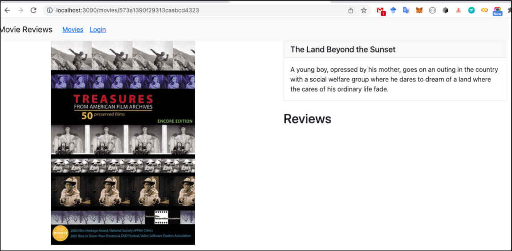

# Lab 05
## Bài 1: Kết nối tới Backend.
### 1.1 Cài đặt axios cho dự án hiện tại.

Để cài đặt axios cho dự ánh hiện tại ta sử dụng lệnh
```
npm install axios
```
### 1.2 Tạo lớp dịch vụ có tên MovieDataService trong thư mục .src/services/movies.js
### 1.3 Tạo các lời gọi dịch vụ tới backend, sử dụng axios để gọi bao gồm:
- getAll();
- get(id);
- createReview(data);
- updateReview(data);
- deleteReview(data);
- getRatings();


Để thực hiện câu lệnh trên ta tạo file movies.js trong thư mục .src/services/

```JavaScript
import axios from "axios";

class MovieDataService {
    getAll(page = 0) {
        return axios.get(`http://localhost:5000/api/v1/movies?page=${page}`)
    }

    get(id) {
        return axios.get(`http://localhost:5000/api/v1/movies/id/${id}`)
    }

    find(query, by = "title", page = 0) {
        return axios.get(`http://localhost:5000/api/v1/movies?${by}=${query}&page=${page}`)
    }

    createReview(data) {
        return axios.post("http://localhost:5000/api/v1/movies/review", data)
    }

    updateReview(data) {
        return axios.put("http://localhost:5000/api/v1/movies/review", data)
    }

    deleteReview(id, userId) {
        return axios.delete(
            "http://localhost:5000/api/v1/movies/review",
            { data: { review_id: id, user_id: userId } }
        )
    }

    getRatings() {
        return axios.get("http://localhost:5000/api/v1/movies/ratings")
    }
}

export default MovieDataService;
```

## Bài 2: Xây dựng MoviesList Component.
### 2.1 Tạo các biến trạng thái: movies, searchTitle, searchRating, ratings sử dụng useState().

```JavaScript
const [movies, setMovies] = useState([]);
const [searchTitle, setSearchTitle] = useState('');
const [searchRating, setSearchRating] = useState('');
const [ratings, setRatings] = useState(['All Ratings']);
```

### 2.2 Tạo 2 phương thức retrieveMovies() và retrieveRatings() để lấy thông tin movie cùng danh sách các loại ratings. Và dùng useEffect() để gọi chung sau khi giao diện kết xuất xong.

```JavaScript
useEffect(() => {
    retrieveMovies();
    retrieveRatings();
}, []);

const retrieveMovies = () => {
    MovieDataService.getAll()
        .then(response => {
            setMovies(response.data.movies);
        })
        .catch(e => {
            console.log(e);
        });
};

const retrieveRatings = () => {
    MovieDataService.getRatings()
        .then(response => {
            setRatings(['All Ratings', ...response.data]);
        })
        .catch(e => {
            console.log(e);
        });
};
```

### 2.3 Tạo 2 search form gồm tìm theo title, và tìm theo rating.

```JavaScript
<Form>
    <Row className="mb-3">
        {/* Search by title */}
        <Col>
            <Form.Control
                type="text"
                placeholder="Search by title"
                value={searchTitle}
                onChange={onChangeSearchTitle}
            />
            <Button variant="primary" className="mt-2" onClick={findByTitle}>
                Search
            </Button>
        </Col>

        {/* Search by rating */}
        <Col>
            <Form.Select value={searchRating} onChange={onChangeSearchRating}>
                {ratings.map((rating, index) => (
                    <option key={index} value={rating}>{rating}</option>
                ))}
            </Form.Select>
            <Button variant="primary" className="mt-2" onClick={findByRating}>
                Search
            </Button>
        </Col>
    </Row>
</Form>
```

### 2.4 Hiển thị các movie bằng <Card> của React-bootstrap.

```JavaScript
<Row xs={1} md={3} className="g-4">
    {movies && movies.map((movie) => (
        <Col key={movie._id}>
            <Card className="h-100">
                <Card.Img variant="top" src={movie.poster} onError={(e) => { e.target.onerror = null; e.target.src = 'https://via.placeholder.com/200x300?text=No+Image'; }} />
                <Card.Body>
                    <Card.Title>{movie.title}</Card.Title>
                    <Card.Text>Rating: {movie.rated}</Card.Text>
                    <Card.Text>{movie.plot}</Card.Text>
                    <Link to={`/movies/${movie._id}`}>
                        <Button variant="primary">View Reviews</Button>
                    </Link>
                </Card.Body>
            </Card>
        </Col>
    ))}
</Row>
```

### 2.5 Hiện thực 2 phương thức findByTitle() và findByRating() để tìm phim theo Title hoặc Rating.

```JavaScript
const findByTitle = () => {
    MovieDataService.find(searchTitle, 'title')
        .then(response => {
            setMovies(response.data.movies);
        })
        .catch(e => {
            console.log(e);
        });
};

const findByRating = () => {
    if (searchRating === 'All Ratings') {
        retrieveMovies();
        return;
    }
    MovieDataService.find(searchRating, 'rated')
        .then(response => {
            setMovies(response.data.movies);
        })
        .catch(e => {
            console.log(e);
        });
};
```

## Bài 3. Hiển thị thông tin trang movie khi nhấn vào 'View Reviews'.
### 3.1 Thiết lập mã nguồn cho component Movie trong tệp tin ./components/movie.js gồm:
- Biến trạng thái movie để lưu trữ thông tin chi tiết của movie như id, title, rated, reviews.

```JavaScript
const [movie, setMovie] = useState({
    id: null,
    title: "",
    rated: "",
    reviews: []
});
```

### 3.2 Xây dựng mã nguồn cho phương thức getMovie() trong component này để gọi phương thức get() trong MovieDataService.

```JavaScript
const { id } = useParams();

useEffect(() => {
    getMovie(id);
}, [id]);

const getMovie = (id) => {
    MovieDataService.get(id)
        .then(response => {
            setMovie(response.data);
        })
        .catch(e => {
            console.log(e);
        });
};
```

### 3.3 Trang trí cho phần JSX trả về để hiển thị như hình:


```JavaScript
return (
    <div>
        <Container>
            <Row>
                <Col md={5}>
                    
                </Col>
                <Col md={7}>
                    <Card>
                        <Card.Header as="h5">{movie.title}</Card.Header>
                        <Card.Body>
                            <Card.Text>{movie.plot}</Card.Text>
                        </Card.Body>
                    </Card>
                    <h3 className="mt-4">Reviews</h3>
                </Col>
            </Row>
        </Container>
    </div>
);
```

## Bài 4. Hiển thị danh sách review tương ứng cho từng phim dưới phần Plot.

### 4.1 Viết đoạn mã nguồn JSX cho phép hiển thị danh sách review cho phim.

```JavaScript
{movie.reviews && movie.reviews.length > 0 ? (
    movie.reviews.map((review, index) => (
        <Card key={index} className="mb-2">
            <Card.Body>
                <Card.Title>{review.name}</Card.Title>
                <Card.Text>{review.review}</Card.Text>
                <Card.Text>
                    <small className="text-muted">
                        {review.date ? new Date(review.date).toDateString() : ''}
                    </small>
                </Card.Text>
                {user && user.id === review.user_id && (
                    <div>
                        <Link
                            to={`/movies/${id}/review`}
                            state={{ currentUser: user, movie, currentReview: review }}
                        >
                            <Button variant="warning" size="sm" className="me-2">Edit</Button>
                        </Link>
                        <Button
                            variant="danger"
                            size="sm"
                            onClick={() => deleteReview(review._id, index)}
                        >
                            Delete
                        </Button>
                    </div>
                )}
            </Card.Body>
        </Card>
    ))
) : (
    <p>No reviews yet.</p>
)}
```

### 4.2 Xem lại slide 73 – chương 2 để hiểu cách thêm 1 review cho phim, và tiến hành thêm một số review thông qua các công cụ hỗ trợ như Postman, Insomnia.

Sử dụng Postman, Insomnia hoặc `curl` để gửi một HTTP POST request tới API thêm review:

- **Method**: `POST`
- **URL**: `http://localhost:5000/api/v1/movies/review`
- **Headers**: `Content-Type: application/json`
- **Body** (raw JSON):

```json
{
  "movie_id": "573a1390f29313caabcd516c",
  "review": "Phim rất hay, ý nghĩa sâu sắc!",
  "user_id": "user123",
  "name": "Nguyen Van A"
}
```

Kết quả trả về thành công:
```json
{
  "status": "success"
}
```

### 4.3 Điều chỉnh lại cách hiển thị giờ với momentjs.

**Bước 1:** Cài đặt thư viện `moment` cho thư mục `frontend`:
```bash
cd frontend
npm install moment
```

**Bước 2:** Cập nhật file `./components/movie.js` để import và sử dụng `moment`:

```JavaScript
// Thêm dòng import moment
import moment from 'moment';

// ...
// Tìm đến phần hiển thị review.date và thay đổi đoạn code:
<small className="text-muted">
    {review.date ? moment(review.date).format("Do MMMM YYYY") : ''}
</small>
```